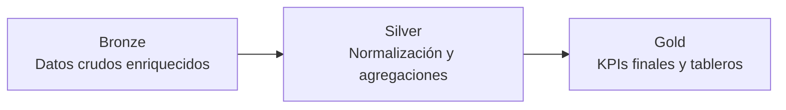

# 🛒 Retail Analytics

## 📖 Introducción

Este proyecto implementa un pipeline de analítica de datos para el **dataset Online Retail**.  
El objetivo es transformar datos crudos de ventas en **indicadores de negocio (KPIs)** útiles para equipos de ventas, marketing y operaciones.

A través de un esquema en tres capas (**Bronze → Silver → Gold**), se limpian, normalizan y enriquecen los datos para responder preguntas clave como:

- ¿Cuáles son los productos más vendidos y rentables?
- ¿Quiénes son los clientes más valiosos y su comportamiento de compra?
- ¿Qué países generan más ventas y devoluciones?
- ¿Cuál es la retención y el churn de clientes?
- ¿Cómo clasificar los productos con un análisis ABC?

---

## 📊 Dataset de Entrada

- Fuente: [Online Retail Dataset – UCI Machine Learning Repository](https://archive.ics.uci.edu/ml/datasets/online+retail)
- Periodo: Diciembre 2010 a Diciembre 2011
- Filas: 541,909 transacciones
- Columnas originales:
  - InvoiceNo, StockCode, Description, Quantity, InvoiceDate, UnitPrice, CustomerID, Country
- Columnas añadidas:
  - UnitCost, MarginPct (estimados para calcular rentabilidad)

---

## 🏗️ Arquitectura del Proyecto

El pipeline sigue tres capas:

- **Bronze** → Datos crudos enriquecidos (se añaden costos y márgenes).
- **Silver** → Tablas intermedias, normalizadas por clientes, productos, países y meses.
- **Gold** → KPIs listos para tableros BI (Looker Studio, Power BI, Streamlit).

---

## ⚙️ Cómo ejecutar el pipeline

- `python3 src/run_pipeline.py` — ejecuta todas las tareas definidas en `configs/artifacts.yml` respetando dependencias.
- `python3 src/run_pipeline.py company_monthly_kpis country_tables` — ejecuta solo las tareas solicitadas.
- `python3 scripts/rebuild_gold_parquet.py` — reconstruye únicamente las salidas GOLD y deja los `.parquet` listos para Looker.
- `python3 scripts/qc_gold.py` — valida rangos de fechas, NaN/Inf y coherencia entre KPIs de país y compañía.
- `python3 scripts/upload_parquet_to_bq.py --project <GCP_PROJECT>` — sube todos los Parquet a BigQuery (`dataset=retail_gold` por defecto).

> Requisito: crear y activar un entorno virtual con `pip install -r requirements.txt`.

---

## 🪙 Diccionario de datos GOLD (parquet)

- `company_monthly_kpis.parquet`
  - `period` (date, inicio de mes), `YearMonth`, `orders`, `customers`, `items_sold`, `gmv`, `returns_value`, `return_rate_value`, `net_sales`, `cogs_net`, `gp_net`, `gross_margin_pct`, `net_sales_mom`, `aov`.
- `country_monthly_kpis.parquet`
  - `period`, `YearMonth`, `Country`, `orders`, `customers`, `items_sold`, `gmv`, `returns_value`, `return_units_abs`, `net_sales`, `cogs_net`, `gp_net`, `gross_margin_pct`, `net_sales_share`, `net_sales_mom`, `aov`, `return_rate_value`, `return_rate_units`.
- `country_kpis.parquet`
  - Snapshot lifetime por país con `buyers` **distintos**, `orders`, `items_sold`, `return_units_abs`, métricas monetarias y `net_sales_share_total`.
- `product_monthly_kpis.parquet`
  - `period`, `YearMonth`, `StockCode`, `description_mode`, `units_sold`, `gmv`, `returns_value`, `return_units_abs`, `net_sales`, `cogs_net`, `gp_net`, `orders`, `buyers`, `aov`, `gross_margin_pct`, `return_rate_units`, `return_rate_value`, `net_sales_mom`.
- `product_kpis.parquet` y `product_abc.parquet`
  - Snapshot lifetime con compradores únicos, tasas de devolución y clasificación ABC por contribución a ventas netas.
- `customer_monthly_kpis.parquet`
  - `period`, `YearMonth`, `customer_id`, `orders` (solo ventas), `items_sold` (solo ventas), `gmv`, `returns_value`, `net_sales`, `cogs_net`, `gp_net`, `aov`, `gross_margin_pct`, `net_sales_mom`.
- `customer_kpis.parquet`
  - Snapshot lifetime con RFM, CLV estimado (últimos 3m * 12), `churn_risk` por recency y métricas financieras.
- `customer_retention_monthly.parquet`
  - `period`, `active_customers`, `new_customers`, `retained`, `reactivated`, `churned`.
- `returns_*` (por factura/producto/país/mes)
  - Métricas absolutas (`return_units_abs`, `returns_value`, `returns_cogs`) y tasas (`return_rate_units`, `return_rate_value`).

Todas las salidas de la capa GOLD se guardan en `data/gold/*.parquet` utilizando `pyarrow`, sin cálculos derivados a nivel de Looker.

---

## ✅ Tests

- `python3 -m unittest discover -s tests` — valida la lógica crítica de KPIs (conteo de compradores únicos, separación ventas/devoluciones).
