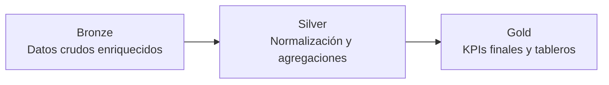

# 🛒 Retail Analytics

## 📖 Introducción

Este proyecto implementa un pipeline de analítica de datos para el **dataset Online Retail**.  
El objetivo es transformar datos crudos de ventas en **indicadores de negocio (KPIs)** útiles para equipos de ventas, marketing y operaciones.

A través de un esquema en tres capas (**Bronze → Silver → Gold**), se limpian, normalizan y enriquecen los datos para responder preguntas clave como:

- ¿Cuáles son los productos más vendidos y rentables?
- ¿Quiénes son los clientes más valiosos y su comportamiento de compra?
- ¿Qué países generan más ventas y devoluciones?
- ¿Cuál es la retención y el churn de clientes?
- ¿Cómo clasificar los productos con un análisis ABC?

---

## 📊 Dataset de Entrada

- Fuente: [Online Retail Dataset – UCI Machine Learning Repository](https://archive.ics.uci.edu/ml/datasets/online+retail)
- Periodo: Diciembre 2010 a Diciembre 2011
- Filas: 541,909 transacciones
- Columnas originales:
  - InvoiceNo, StockCode, Description, Quantity, InvoiceDate, UnitPrice, CustomerID, Country
- Columnas añadidas:
  - UnitCost, MarginPct (estimados para calcular rentabilidad)

---

## 🏗️ Arquitectura del Proyecto

El pipeline sigue tres capas:

- **Bronze** → Datos crudos enriquecidos (se añaden costos y márgenes).
- **Silver** → Tablas intermedias, normalizadas por clientes, productos, países y meses.
- **Gold** → KPIs listos para tableros BI (Looker Studio, Power BI, Streamlit).

